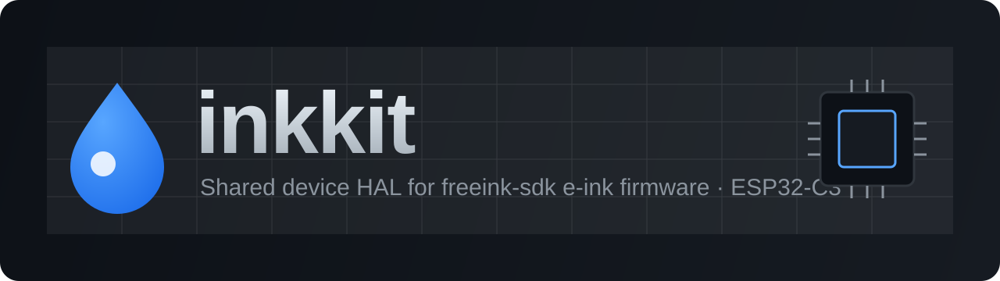
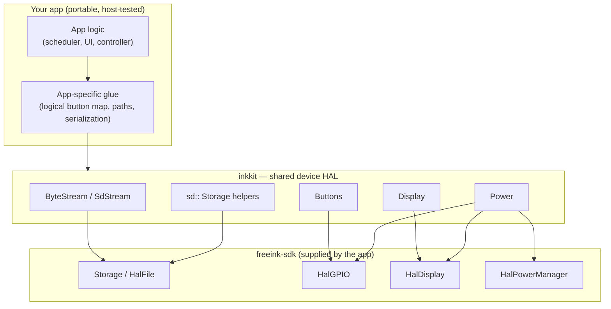
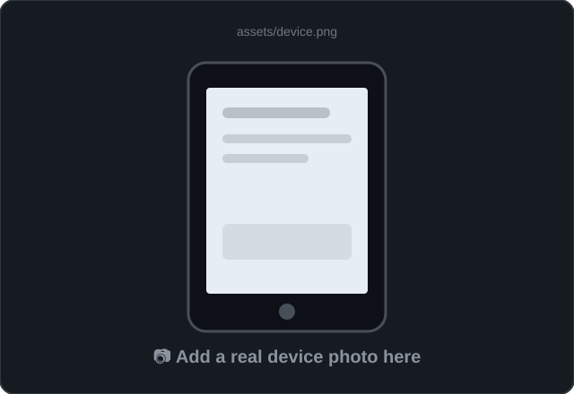

<!-- SEO: inkkit — freeink-sdk device HAL library for ESP32-C3 e-ink firmware (Xteink X4/X3), PlatformIO, SD card storage, GPIO buttons, e-paper display -->
<div align="center">



<h1>inkkit</h1>

<p><strong>The shared device-layer HAL for <a href="https://github.com/Free-Ink/freeink-sdk">freeink-sdk</a> e-ink firmware.</strong><br>
One tested home for the SD-card, GPIO button, e-paper display and power idioms that every Xteink X4/X3 (ESP32-C3) app re-writes.</p>

<p>
  <a href="LICENSE"></a>
  
  
  
  
  
</p>

<p>
  <a href="#-quick-start">Quick start</a> ·
  <a href="#-modules">Modules</a> ·
  <a href="#-architecture">Architecture</a> ·
  <a href="#-faq">FAQ</a> ·
  <a href="#-who-uses-inkkit">Who uses it</a>
</p>

</div>

---

## What is inkkit?

**inkkit is a lightweight, MIT-licensed C++17 PlatformIO library that gives freeink-sdk–based e-ink firmware a single, tested device abstraction layer (HAL).** It wraps the freeink-sdk `Storage`, `gpio`, `display` and `powerManager` singletons — plus SD-card `HalFile` byte and line streaming — behind small, injectable helpers, so every Xteink X4/X3 (ESP32-C3) app stops re-deriving and re-verifying the same hardware calls.

It was extracted from two shipping firmwares — [InkCards](https://github.com/mohitagw15856/inkcards) (a spaced-repetition flashcard device) and [HabitInk](https://github.com/mohitagw15856/habitink) (a habit tracker) — which had each grown their own parallel copy of this glue. inkkit is now the one place those SDK-facing calls live and get confirmed against real hardware.

> **In one line:** inkkit is to freeink-sdk e-ink apps what a board-support HAL is to any embedded project — the thin, shared, testable seam between portable app logic and the SDK.

---

## ✨ Why inkkit

- **🧩 One source of truth for SDK calls.** SD paths, `HalFile` reads/writes, GPIO edges, panel flush and deep sleep live once. Confirm an SDK method on hardware here → both apps inherit the fix.
- **🪶 Thin & header-first.** Mostly inline headers with a single `.cpp`. No framework, no runtime, no allocations you didn't ask for.
- **💉 Dependency-injected.** Wrappers take the SDK singleton by reference (`Buttons(gpio)`, `Display(display)`), so each app keeps its own logical button map, on-disk paths and serialization on top.
- **🧪 Host-friendly.** Every SDK-touching line is guarded by `#ifdef ARDUINO`; the portable `ByteReader`/`ByteWriter` interfaces compile on the host, so pulling inkkit into a native/CI build costs nothing.
- **📦 Drop-in PlatformIO.** One `lib_deps` line, nothing else. inkkit **vendors** the device layer it wraps: the `Hal*` layer (adapted from CrossPoint Reader, MIT) plus the FreeInk SDK hardware libraries (MIT) it needs. See `THIRD_PARTY.md` for exact provenance.
- **🩹 Hardware-free stub.** Build with `-DINKKIT_HAL_STUB` and the same wrapper API compiles and links against inert stand-ins: no SPI, no SD, no panel. Useful for CI-style smoke builds of app firmware.

> **Status: builds in CI, not yet verified on device.** Everything hardware-facing carries `TODO(hardware-test)` markers.

---

## 🚀 Quick start

Add inkkit to the **device / on-hardware** PlatformIO environment (leave your host/CI env untouched — it doesn't build the device layer):

```ini
[env:xteink_x4]        ; and an identical [env:xteink_x3]
platform = https://github.com/pioarduino/platform-espressif32/releases/download/55.03.37/platform-espressif32.zip
board = esp32-c3-devkitm-1
framework = arduino
build_flags =
  -std=gnu++2a
  -DEINK_DISPLAY_SINGLE_BUFFER_MODE=1
  -DFREEINK_DEVICE_X4=1
  -DFREEINK_DEVICE_X3=1
lib_deps =
  https://github.com/mohitagw15856/inkkit.git#v0.1.0-rc1
```

The `FREEINK_DEVICE` flags are set together: one binary serves both devices (the vendored HAL detects X4 vs X3 at runtime). See `examples/minimal/` for a complete buildable project.

Then include what you need and wire it to your SDK singletons:

```cpp
#include <inkkit/Storage.h>
#include <inkkit/SdStream.h>

// Load a file off the SD card and hand it to portable parsing code.
HalFile file;
if (inkkit::sd::openRead("APP", "/app/state.bin", file)) {
  inkkit::SdFileReader reader(file);   // presents HalFile as a seekable ByteReader
  myParser.load(reader);
  file.close();
}

// Read a text log line-by-line without buffering the whole file.
if (inkkit::sd::openRead("APP", "/app/log.tsv", file)) {
  inkkit::readLines(file, [](const std::string& line) { handle(line); });
  file.close();
}
```

```cpp
#include <inkkit/Buttons.h>

inkkit::Buttons buttons(gpio);   // gpio = the freeink-sdk singleton
buttons.update();
if (buttons.wasReleased(HalGPIO::BTN_CONFIRM)) toggleToday();
```

---

## 🧱 Modules

| Header | What it gives you |
|---|---|
| **`inkkit/ByteStream.h`** | Portable `ByteReader` / `ByteWriter` interfaces + `MemoryReader` / `MemoryWriter`. No SDK dependency — compiles on host. |
| **`inkkit/SdStream.h`** | `SdFileReader` / `SdFileWriter` over a `HalFile`, and `readLines()` for memory-bounded text streaming. |
| **`inkkit/Storage.h`** | `inkkit::sd::*` — `exists`, `ensureDir`, `openRead` / `openWrite` / `openAppend`, `readWholeFile` / `writeWholeFile`, `listFiles`. |
| **`inkkit/Buttons.h`** | `Buttons` — HalGPIO edge queries by index, `powerHeldMs()`, and `WakeCause`. |
| **`inkkit/Display.h`** | `Display` — 1-bit framebuffer access and full/fast e-paper refresh. |
| **`inkkit/Power.h`** | `Power` — uptime (`millis()`) and `deepSleep()`. |
| **`inkkit/inkkit.h`** | Umbrella header that includes all of the above. |

---

## 🏗️ Architecture

inkkit is the shaded seam between each app's portable logic and the freeink-sdk. Apps keep their own domain code and logical mappings; inkkit owns only the raw SDK calls.



**Layering rule:** portable app logic never `#include`s the SDK. It talks to inkkit (or the app's own interfaces built on inkkit), and inkkit is the only code that names `HalStorage.h`, `HalGPIO.h`, `HalDisplay.h` or `HalPowerManager.h`.

---

## 🖼️ Gallery

> These are placeholders — inkkit is a headless library, but the apps that use it are not. Drop real device photos/GIFs into `assets/` (e.g. `assets/device.png`, `assets/demo.gif`) and swap the `src` paths below.

<div align="center">
<table>
<tr>
<td align="center"><br><sub>InkCards / HabitInk on the Xteink X4/X3</sub></td>
<td align="center"><br><sub>Wake → log → sleep, streamed off SD via inkkit</sub></td>
</tr>
</table>
</div>

---

## 🤝 Who uses inkkit

| Project | What it is | How it uses inkkit |
|---|---|---|
| [**InkCards**](https://github.com/mohitagw15856/inkcards) | SM-2 spaced-repetition flashcards on e-ink | SD deck/state streaming, `Storage` helpers, GPIO grade buttons |
| [**HabitInk**](https://github.com/mohitagw15856/habitink) | Minimalist e-ink habit tracker | Config + log persistence, panel flush, button input, deep sleep |

Building something else on the freeink-sdk? inkkit is designed to be the shared floor — open a PR to add your project here.

---

## ❓ FAQ

<details open>
<summary><strong>What is inkkit used for?</strong></summary>

inkkit provides the shared device-layer HAL (hardware abstraction layer) for e-ink firmware built on the freeink-sdk. It centralizes SD-card storage, GPIO button input, e-paper display flushing and deep-sleep power control so multiple ESP32-C3 apps don't each re-implement the same SDK calls.
</details>

<details>
<summary><strong>Which hardware and framework does inkkit target?</strong></summary>

The Xteink X4 and X3 e-ink devices, which use an **ESP32-C3** under the **Arduino** framework via **PlatformIO** and the **freeink-sdk**. The portable `ByteStream` interfaces also compile on a plain host toolchain for unit testing.
</details>

<details>
<summary><strong>Does inkkit include the freeink-sdk?</strong></summary>

Yes, since v0.1.0-rc1. inkkit vendors the `Hal*` layer (adapted from CrossPoint Reader, MIT) and the FreeInk SDK hardware libraries it wraps (FreeInkDisplay, SDCardManager, InputManager, PowerManager, BatteryMonitor, XteinkDetect, BoardConfig — all MIT), so one pinned `lib_deps` line is the whole device layer. Provenance and upstream commits are recorded in `THIRD_PARTY.md`. The only registry dependency is `greiman/SdFat`.
</details>

<details>
<summary><strong>Will adding inkkit break my host or CI build?</strong></summary>

No. Every SDK-touching line is wrapped in `#ifdef ARDUINO`, so on a native/host build it compiles away. In practice you add inkkit only to your device/on-hardware PlatformIO environment, so host and CI builds never even fetch it.
</details>

<details>
<summary><strong>How do I install inkkit in PlatformIO?</strong></summary>

Add `https://github.com/mohitagw15856/inkkit.git#v0.1.0-rc1` (always pin a tag) to the `lib_deps` of your device environment in `platformio.ini`. See <a href="#-quick-start">Quick start</a>.
</details>

<details>
<summary><strong>How is inkkit different from the freeink-sdk itself?</strong></summary>

The freeink-sdk is the low-level hardware driver layer. inkkit sits one level up: it's the thin, opinionated, app-shared convenience layer over the SDK — file streaming, path helpers, button edges, wake reasons — so app code stays portable and testable.
</details>

<details>
<summary><strong>Is inkkit production-ready?</strong></summary>

inkkit is `0.1.0-rc1`. The wrapper API is verified against the vendored device layer at compile time and builds in CI for both Xteink targets, but nothing has been run on physical hardware yet: hardware-facing behaviour carries `TODO(hardware-test)` markers, tracked in the "Hardware verification pending" issue. It's used by four apps and designed for easy on-device verification in one place.
</details>

---

## 🗺️ Compatibility

| | |
|---|---|
| **MCU** | ESP32-C3 (Xteink X4 / X3) |
| **Framework** | Arduino |
| **Build system** | PlatformIO (`library.json`) |
| **Language** | C++17 |
| **Depends on** | freeink-sdk (provided by the consuming app) |
| **License** | MIT |

---

## 🛠️ Contributing

inkkit is meant to stay small and boring — that's the point. Good contributions:

- Confirm a `TODO(hardware-test)` SDK call against real hardware and drop the marker.
- Add a helper only when **two or more** apps genuinely need it (no speculative surface).
- Keep SDK calls behind `#ifdef ARDUINO` and portable interfaces host-compilable.

---

## 📄 License

MIT © inkkit contributors — see [LICENSE](LICENSE).

<div align="center"><sub>Built for the freeink-sdk e-ink ecosystem · Xteink X4 / X3 · ESP32-C3</sub></div>
